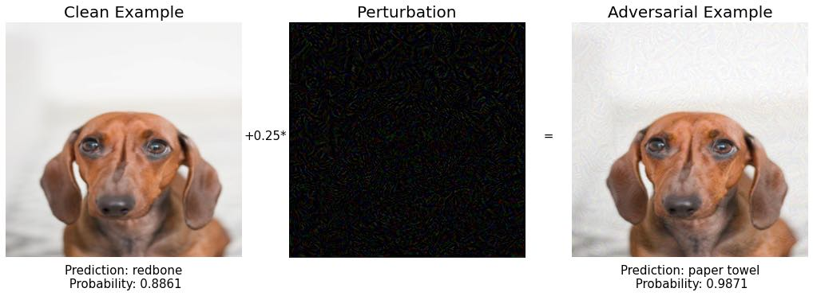

# Breaking deep learning models with adversarial examples

## What is this repo about
PyTorch code to generate adversarial examples that break Inception V3.

If you do not know what adversarial examples are go check my [blog post](http://datamachines.xyz/2021/07/05/adversarial-examples-to-break-deep-learning-models/).

## Setup

You need Python >= 3.7 and a tool to install the exact packages you need for this
code to run as expected.

Two popular tools are virtualenv (a bit old) and [poetry](https://python-poetry.org/) (my favourite).

Instructions for virtualenv:
```
...cd into the root directory...
$ pip install virtualenv
$ virtualenv venv
$ source venv/bin/activate
$ pip install -r requirements.txt
```

Instructions for Poetry:

```
.. install poetry if you haven't
$ curl -sSL https://raw.githubusercontent.com/python-poetry/poetry/master/get-poetry.py | python -

.. cd into the root directory of the repo
$ poetry install
```

## How to generate adversarial examples

We use the vanilla fast gradient sign method


And its iterative version.


In the code you can find the "magic" that transforms a nice puppy into a paper towel.




## Contact me

If you have already been thinking about possible solutions to the adversarial examples problem,
get in touch, we can work on it together. You can reach me at [plabartbajo@gmail.com](mailto:plabartabajo@gmail.com).

If you would like to learn more about adversarial ML and other machine learning topics
visit my [blog](http://datamachines.xyz/blog) and [subscribe](http://datamachines.xyz/subscribe) to the datamachines newsletter.

Have a great day