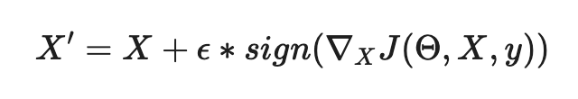
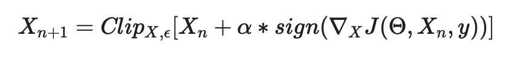

<div align="center">
<h1>Breaking deep learning models with adversarial examples 😈 </h1>
<i><h3>Or maybe it's just that beautiful things are so easily broken by the world.</h3></i>
<h4>-- Cassandra Clare, City of Fallen Angels</h4>
</div>


## Table of Contents

1. [What is this repo about?](#what-is-this-repo-about)     
2. [Quick setup](#quick-setup)   
3. [Fast Gradient Sign method](#fast-gradient-sign-method)
4. [Adversarial example generator](#adversarial-example-generator)
5. [Let's connect!](#lets-connect)  


## What is this repo about?

PyTorch code and [streamlit app](https://share.streamlit.io/paulescu/adversarial-machine-learning/main/src/streamlit_app.py) that demonstrate how easy it is to break deep learning models in computer vision.
More precisely, Inception V3.

If you do not know what adversarial examples are go check my blog post.

[📝 Adversarial examples to break deep learning models](http://datamachines.xyz/2021/07/05/adversarial-examples-to-break-deep-learning-models/)  

Also available in [Medium](https://towardsdatascience.com/adversarial-examples-to-break-deep-learning-models-e7f543833eae) and in [Hackernoon](https://hackernoon.com/adversarial-examples-in-machine-learning-explained)

## Quick setup

Create a virtualenv with your preferred tool (`virtualenv`, `conda`, `poetry`)
and activate it.

Then install the code as a local package
```
$ (venv) pip install .
```


## Fast Gradient Sign method

We use the vanilla fast gradient sign method




And its iterative version.




In the code you can find the "magic" that transforms a nice puppy into a paper towel.


## Adversarial example generator

👉 [Streamlit app to generate adversarial examples](https://share.streamlit.io/paulescu/adversarial-machine-learning/main/src/streamlit_app.py)


## Let's connect

If you want to learn more about real-world ML topics and become a better data scientist

👉 [Subscribe](http://datamachines.xyz/subscribe) to the datamachines newsletter.

👉🏽 Follow me on [Twitter](https://twitter.com/paulabartabajo_) and/or [LinkedIn](https://www.linkedin.com/in/pau-labarta-bajo-4432074b/)
